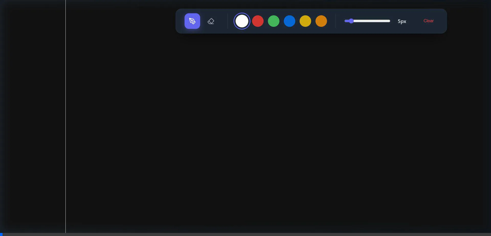

# Figma-Style Collaborative Whiteboard

This repository contains a fully functional real-time collaborative whiteboard built from the ground up for instantaneous multi-user syncing.

## Live Demo
Check out the raw real-time engine running across multiple simulated browsers (Frames instantly synchronized via WebSockets & Redis):


## Architecture & Tech Stack
- **Frontend**: React (Vite), HTML5 Canvas, Tailwind-inspired Vanilla CSS, Lucide-React icons.
- **Backend**: Node.js, Express, Socket.io
- **Databases**: 
  - **Upstash (Redis)**: Serverless WebSockets Pub/Sub adapter handling realtime stroke distribution between distinct backend nodes.
  - **Supabase (PostgreSQL)**: Permanent auto-saving of canvas pixel state.

## Project Structure
The active project is entirely contained within the `figma-whiteboard` directory, split into two decoupled packages:
* **`/figma-whiteboard/client`**: The React frontend application.
* **`/figma-whiteboard/server`**: The Node.js WebSocket and API backend.

*(Note: Legacy SyncNote codebase files have been archived/removed from the root directory to ensure a clean structural environment).*

## How to Run Locally

### 1. Database Setup
Ensure you have created the `boards` table in your Supabase SQL editor:
```sql
create table public.boards (
  id text primary key,
  canvas_state text,
  updated_at timestamp with time zone default timezone('utc'::text, now())
);
```
Ensure your `figma-whiteboard/server/.env` file is heavily secured and populated with your Supabase keys and Upstash Redis URL.

### 2. Start the Backend
```bash
cd figma-whiteboard/server
npm start
```
*The WebSocket gateway will boot on port 3001.*

### 3. Start the Frontend
```bash
cd figma-whiteboard/client
npm run dev
```

Open `http://localhost:5173` in multiple browser windows or tabs. If configured correctly, any strokes drawn in window A will instantly broadcast and render in window B!
